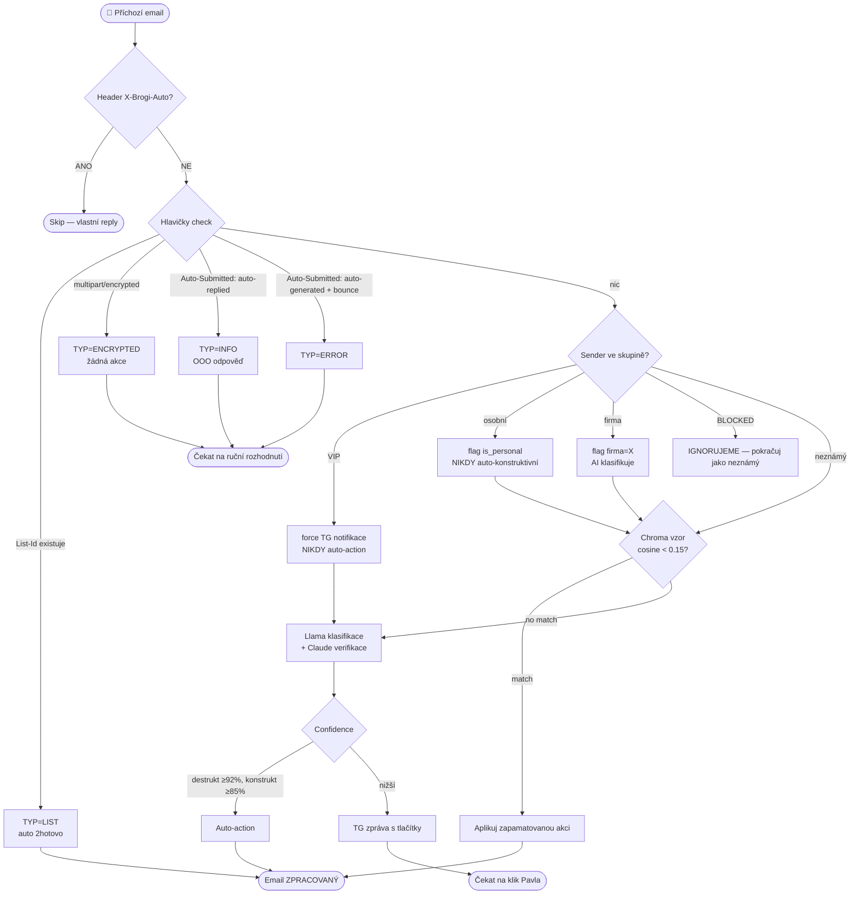

# BrogiASIST — Email Semantics v1

> Kanonický referenční dokument: TYP / STATUS / ACTION + decision flow.
> Verze 1.0 — 2026-04-26
> Předchází implementaci. Sjednocuje dohody z chat sessions `3d85524c` (2026-04-22 až 25) a `68e2c840` (2026-04-26).

---

## 0. Účel

Email systém klasifikuje příchozí emaily do kategorií, sleduje jejich životní cyklus a vykonává akce na pokyn Pavla (TG / WebUI / Apple Mail). Všechny tři rozhraní sdílejí jednu pravdu — Postgres `email_messages` tabulku, synchronizovanou s IMAP `\Seen` flagem obousměrně.

Klíčový princip: **Pavel potvrzuje rozhodnutí, systém vykonává.** Auto-akce jsou povolené pouze nad pevnými confidence thresholdy a nikdy pro `2unsub`/`2hotovo`/`2skip`.

---

## 1. TYP (9 hodnot, velkými písmeny)

Klasifikuje **obsah** emailu, ne odesílatele. Jedna hodnota per email.

| TYP | Definice | Příklad |
|---|---|---|
| `ÚKOL` | Někdo na mě v obsahu čeká nebo ode mě něco očekává | „Pošli mi prosím cenovou nabídku do pátku" |
| `DOKLAD` | Faktura, výpis, objednávka, paragon, formální papírová stopa | mBank měsíční výpis, faktura od dodavatele |
| `NABÍDKA` | Komerční sdělení (kup si, sleva, akce) | „Sleva 30 % na A24 LUTs" |
| `NOTIFIKACE` | Systém/služba mě informuje o události (vč. POTVRZENÍ objednávky, login alertů) | GitHub: „Login from new location", BrogiServer monitoring |
| `POZVÁNKA` | Calendar invite — `Invitation:` v subject nebo `.ics` příloha | Google Calendar: „Spánková laboratoř Děčín" |
| `INFO` | Vše ostatní informativní (firma/systém, ne komerční, ne notifikace) | newsletter čistě informativní, blog update |
| `ERROR` | Bounce / Delivery Status Notification / mail daemon | „Email to xyz could not be delivered" |
| `LIST` | Mailing list (RFC 2369 hlavičky `List-Id`, `List-Post`) | linux-kernel list, GitHub Discussions |
| `ENCRYPTED` | Šifrovaný obsah (S/MIME, PGP) — AI nemůže přečíst | `Content-Type: multipart/encrypted` |

**Vyřazeno z v0:** NEWS — sloučeno do INFO. Osobní emaily se rozlišují skupinou kontaktů, ne TYPem.

---

## 2. STATUS (5 hodnot)

Životní cyklus emailu v DB. Synchronizováno obousměrně s IMAP `\Seen` flagem.

| STATUS | Význam |
|---|---|
| `NOVÝ` | Přišel, nikdo neviděl |
| `PŘEČTENÝ` | Pavel viděl (otevřel v Apple Mail / WebUI), nerozhodl |
| `ČEKAJÍCÍ` | Pavel vědomě odložil (akce `2skip`) — „musím se zamyslet" |
| `ZPRACOVANÝ` | Akce provedena (`2of`, `2cal`, `2note`, `2rem`, `2hotovo`, `2unsub`) |
| `SMAZANÝ` | V trash (akce `2spam`) |

### Reverzibilita

| Přechod | Reverzibilní? |
|---|---|
| `NOVÝ` ↔ `PŘEČTENÝ` | ANO (mark as unread v Apple Mail vrátí `NOVÝ`) |
| `* → ZPRACOVANÝ/SMAZANÝ/ČEKAJÍCÍ` | ANO, ale pouze přes akci `2undo` do **1 hodiny** |

### Synchronizace 3 zdrojů

| Trigger | Důsledek |
|---|---|
| Klik v **Apple Mail** | IMAP IDLE detekce `\Seen` flag → DB status update |
| Klik v **Telegram** | DB status update + IMAP `\Seen` set + IMAP move do cílové složky |
| Klik ve **WebUI dashboardu** | DB status update + IMAP `\Seen` set + IMAP move |
| **Auto-action** (≥ threshold) | DB status update + IMAP `\Seen` set + IMAP move |
| **Manuální move** v Apple Mail | IMAP IDLE detekce → DB folder field update |

---

## 3. ACTION (9 hodnot, malými písmeny, prefix `2` = „to")

Sémantika: `2` jako **„to"** (foneticky / anglicky) — kam to přesměrujeme. Jedna ACTION per kliknutí.

| ACTION | Co dělá | Cílový STATUS | Cílová IMAP složka |
|---|---|---|---|
| `2of` | Předá úkol s textem + přílohou(ami) do **OmniFocus inbox**. Příloha = cokoliv. | ZPRACOVANÝ | `BrogiASIST/HOTOVO` |
| `2rem` | Předá text do **Apple Reminders**. Termín z kontextu (Llama → Claude eskalace). | ZPRACOVANÝ | `BrogiASIST/HOTOVO` |
| `2cal` | Pokud `.ics` → spolehlivý parse (priorita), jinak text-parse → Apple Calendar event. **Volitelně Accept reply** (TG potvrzení). | ZPRACOVANÝ | `BrogiASIST/HOTOVO` |
| `2note` | Předá text do **Apple Notes** (žádný termín). | ZPRACOVANÝ | `BrogiASIST/HOTOVO` |
| `2hotovo` | Označí jako vyřízené, žádná systémová akce. | ZPRACOVANÝ | `BrogiASIST/HOTOVO` (DOKLADY pro DOKLAD, NABIDKY pro NABÍDKA) |
| `2del` | **Jednorázové smazání** (duplicity, šum). Zápis do Chroma `email_actions`. **NE**zapisuje `classification_rules` — sender se neoznačí jako spam. | SMAZANÝ | `Trash` (IMAP nativní) |
| `2spam` | Smazání + `classification_rules` (sender → další maily auto-spam) + Chroma `email_actions`. **Volitelně Decline reply** pro POZVÁNKA. | SMAZANÝ | `Trash` (IMAP nativní) |
| `2unsub` | 1) `List-Unsubscribe` header (RFC, preferovaně). 2) Fallback link v textu. | ZPRACOVANÝ | `BrogiASIST/HOTOVO` |
| `2skip` | Nechá v inboxu, žádná akce, jen flag „musím se zamyslet". | ČEKAJÍCÍ | (zůstává v INBOX) |

### Speciální akce

| ACTION | Co dělá |
|---|---|
| `2undo` | Vrátí poslední akci na **1 krok zpět**, TTL **1 hodina**. ZPRACOVANÝ → PŘEČTENÝ, SMAZANÝ → NOVÝ (vrátí z trash). |

### Termín pro 2of/2rem (Llama → Claude eskalace)

```
Llama parsuje text → "do pátku", "do 30. 4.", "co nejdřív", ...
  ↓
Llama confidence ≥ 100 % ?
  ├── ANO → použije termín
  └── NE  → eskalace na Claude Haiku (online)
              ↓
        Claude vrátí: termín / "neuvedeno"
              ├── termín     → použije
              └── neuvedeno  → 2rem bez datumu / 2of bez due date
```

**Žádný fallback „za hodinu"** — buď termín máme, nebo Reminders/OF prostě bez data.

### Auto-action matice

| Kategorie | Threshold | Override |
|---|---|---|
| **Destruktivní** (`2spam`) | confidence ≥ 92 % | nikdy auto pokud sender ve VIP |
| **Konstruktivní** (`2of`, `2cal`, `2note`, `2rem`) | confidence ≥ 85 % | nikdy auto pokud sender osobní (KAMARADI/RODINA/MEDVEDI/MOTO/TRAVEL/FOCENI) |
| **`2unsub`** | nikdy auto | vždy ručně (riziko omylu) |
| **`2hotovo`, `2skip`** | nikdy auto | vždy ručně |
| **`2hotovo` pro TYP=LIST** | vždy auto | žádná TG zpráva |

---

## 4. Skupiny kontaktů (orthogonal signál)

Skupiny v Apple Contacts (1280 kontaktů, 19 skupin) ovlivňují **prioritu a auto-action**, nikoli TYP.

### Mapping skupina → kategorie

| Skupina | # | Kategorie | Sender match |
|---|---:|---|---|
| **VIP ⏰** | 4 | priorita | exact email |
| MEDVEDI 🧸 | 431 | osobní (kamarádi) | exact |
| KAMARADI 🥂 | 86 | osobní | exact |
| RODINA 🛠 | 25 | osobní | exact |
| MOTO 🏍 | 31 | osobní | exact |
| TRAVEL 🗺 | 13 | osobní | exact |
| FOCENI 📸 | 76 | osobní | exact |
| DXP 💼 | 38 | firma vlastní | exact |
| MBANK 👨‍👩‍👦‍👦 | 99 | firma práce | exact |
| JOBS 👁 | 7 | firma práce | exact |
| MFINNACE 👔 | 6 | firma práce | exact |
| PREVIOUS JOBS 🏦 | 19 | firma práce (bývalá) | exact |
| JIMSOFT | 19 | klient/dodavatel | exact |
| PPDX.NET | 18 | klient/dodavatel | exact |
| **DODAVATELE ⚙️** | 226 | dodavatel | **domain match** |
| **ESHOP 🛍** | 74 | eshop | **domain match** |
| **FINANCE 💵** | 22 | finance | **domain match** |
| BLOCKED ⛔️ | 85 | (osobní seznam Pavla, BrogiASIST IGNORUJE) | — |
| seznam bez názvu | 0 | — | — |

**Důsledky:**
- **VIP** → vždy TG notifikace, NIKDY auto-action
- **Osobní** (KAMARADI/MEDVEDI/RODINA/MOTO/TRAVEL/FOCENI) → flag `is_personal=true`, žádná auto-action konstruktivní (2spam stále možný)
- **Firma vlastní/práce** → flag `firma=<skupina>`, AI klasifikuje TYP normálně
- **Dodavatel/eshop/finance** → AI klasifikuje, auto-action povolena
- **BLOCKED** → BrogiASIST tuto skupinu ignoruje (slouží jen Pavlovi mimo systém)

### Kontakty sync

Apple Bridge endpoint `/contacts/all` musí vracet i **skupiny** per kontakt (`groups: [...]`). Sync 2×/den.

---

## 5. Decision flow

### Diagram (Mermaid)



### Pořadí pravidel (priorita 10–99)

| priority | rule | condition | action |
|:-:|---|---|---|
| 10 | `header_list` | `List-Id` exists | `set TYP=LIST, action=2hotovo, end` |
| 20 | `header_encrypted` | `Content-Type: multipart/encrypted` | `set TYP=ENCRYPTED, end` |
| 30 | `header_oof` | `Auto-Submitted: auto-replied` | `set TYP=INFO, end` |
| 40 | `header_bounce` | `Auto-Submitted: auto-generated` AND mailer-daemon | `set TYP=ERROR, end` |
| 50 | `group_vip` | sender ve skupině VIP (exact) | `tg_notify=force, no_auto_action` |
| 60 | `chroma_match` | cosine < 0.15 v Chromě | `apply_remembered_action, end` |
| 70 | `sender_personal` | sender v KAMARADI/MEDVEDI/RODINA/MOTO/TRAVEL/FOCENI (exact) | `flag is_personal=true, no_auto_action` |
| 80 | `ai_fallback` | (default) | `run_llama_classify` |
| 99 | `self_sent` | header `X-Brogi-Auto` (kontrola na začátku) | `skip_classification, end` |

**Skupina BLOCKED je explicitně mimo pipeline.** Slouží Pavlovi mimo systém. BrogiASIST se s ní nepárá.

---

## 6. Schema rozšíření DB

### `decision_rules` (nová tabulka, konfigurovatelná z WebUI)

```sql
CREATE TABLE decision_rules (
  id              SERIAL PRIMARY KEY,
  priority        INTEGER NOT NULL,
  rule_name       VARCHAR(64) UNIQUE NOT NULL,
  condition_type  VARCHAR(32) NOT NULL,   -- 'header','group','chroma','sender','ai_fallback'
  condition_value JSONB NOT NULL,
  action_type     VARCHAR(32) NOT NULL,   -- 'set_typ','set_action','tg_notify','flag','end'
  action_value    JSONB NOT NULL,
  enabled         BOOLEAN DEFAULT TRUE,
  created_at      TIMESTAMPTZ DEFAULT now(),
  updated_at      TIMESTAMPTZ DEFAULT now()
);

CREATE INDEX idx_decision_rules_priority ON decision_rules(priority) WHERE enabled = TRUE;
```

### `email_messages` rozšíření (threading + OF link)

```sql
ALTER TABLE email_messages
  ADD COLUMN message_id   VARCHAR(512) UNIQUE,
  ADD COLUMN in_reply_to  VARCHAR(512),
  ADD COLUMN thread_id    UUID,
  ADD COLUMN of_task_id   VARCHAR(64),
  ADD COLUMN of_linked_at TIMESTAMPTZ,
  ADD COLUMN is_personal  BOOLEAN DEFAULT FALSE,
  ADD COLUMN firma        VARCHAR(64);  -- už existuje, nezavádět znovu

CREATE INDEX idx_email_thread ON email_messages(thread_id);
CREATE INDEX idx_email_of_task ON email_messages(of_task_id) WHERE of_task_id IS NOT NULL;
```

### `apple_contacts` rozšíření (skupiny)

```sql
ALTER TABLE apple_contacts ADD COLUMN groups JSONB DEFAULT '[]'::jsonb;
CREATE INDEX idx_contacts_groups ON apple_contacts USING gin(groups);
```

### `pending_actions` (nová, fronta pro degraded mode)

```sql
CREATE TABLE pending_actions (
  id            SERIAL PRIMARY KEY,
  email_id      UUID NOT NULL REFERENCES email_messages(id),
  action        VARCHAR(16) NOT NULL,    -- 2of, 2cal, 2note, 2rem
  action_data   JSONB,                   -- payload pro Apple Bridge
  created_at    TIMESTAMPTZ DEFAULT now(),
  attempts      INTEGER DEFAULT 0,
  last_error    TEXT,
  status        VARCHAR(16) DEFAULT 'pending'  -- pending, processing, done, failed
);

CREATE INDEX idx_pending_status ON pending_actions(status, created_at);
```

---

## 7. Telegram tlačítka per TYP

| TYP | Tlačítka v TG zprávě |
|---|---|
| `ÚKOL` | `✅ 2hotovo` · `📥 2of` · `⏰ 2rem` · `📝 2note` · `⏭ 2skip` · `🗑 2del` · `🚫 2spam` |
| `DOKLAD` | `📥 2of` (zaplatit) · `📝 2note` · `✅ 2hotovo` · `⏭ 2skip` · `🗑 2del` · `🚫 2spam` |
| `NABÍDKA` | `📝 2note` · `🚫 2unsub` · `⏭ 2skip` · `🗑 2del` · `🚫 2spam` |
| `NOTIFIKACE` | `✅ 2hotovo` · `⏭ 2skip` · `🗑 2del` · `🚫 2spam` |
| `POZVÁNKA` | `📅 2cal + Accept reply` · `📅 2cal jen` · `❌ Decline reply` · `⏭ 2skip` · `🗑 2del` · `🚫 2spam` |
| `INFO` | `✅ 2hotovo` · `⏭ 2skip` · `🚫 2unsub` (jen pokud má List-Unsubscribe) · `🗑 2del` · `🚫 2spam` |
| `ERROR` | `✅ 2hotovo` · `⏭ 2skip` · `🗑 2del` · `🚫 2spam` |
| `LIST` | (žádná TG zpráva, auto-2hotovo) |
| `ENCRYPTED` | `👁 Otevřu sám` · `⏭ 2skip` · `🗑 2del` · `🚫 2spam` |

> `2del` = univerzální „rychle smazat" tlačítko (duplicity, šum). Pošta jde do `Trash`,
> akce se učí v Chromě (příště podobný vzor → návrh 2del), ale sender se **NE**označuje
> jako spam — žádné auto-spam pro další maily od něj. Pro to slouží `2spam`.

### Threading TG flow

Pokud nový email v existujícím threadu, kde už je `of_task_id` set:

```
🔗 Update k existujícímu OF tasku „<subject>"
[📂 Otevřít OF task]  [📎 Append do notes]  [➕ Nový task]  [⏭ Skip]
```

**Žádný auto-vytvoření duplicitního tasku.**

---

## 8. Threading (RFC 5322)

### Detekce vlákna

1. Parse `Message-ID:`, `In-Reply-To:`, `References:` z příchozího emailu (uložit do nových sloupců)
2. SQL: `SELECT thread_id FROM email_messages WHERE message_id = <In-Reply-To>`
3. Pokud match → nový email dostane stejné `thread_id`
4. Pokud nematch → nový email má `thread_id = self.id`
5. **Fallback** (pokud chybí RFC headers): subject normalize (`s/^(Re|Fwd?):\s*//gi`) + sender match v ±7 dní

### Klasifikace v threadu

- **TYP per email** (každý email klasifikován zvlášť — vlákno může změnit charakter, INFO → ÚKOL)
- **Status per email** (každý má vlastní lifecycle)
- **Llama prompt** dostane aktuální email + 200 znaků každého předchozího v threadu jako kontext
- **TG notifikace** ukáže thread context: „📧 Re: Subject (5/5 ve vlákně)". Pokud TYP nového ≠ TYP předchozího → **priorita up** (varování v TG)

### Email ↔ OF task linking

- Klik `2of` → bot vytvoří OF task přes Apple Bridge → ukládá `of_task_id` do `email_messages`
- Do **OF task notes** vloží `[email#<short-id>]` referenci
- Příští email v threadu (`thread_id` match) s `of_task_id` set → TG: „Update k existujícímu OF tasku" + tlačítka (viz výše)
- **Pravidlo: 1 email = 1 OF task.** Žádné auto-duplikáty v threadu.

---

## 9. Failure handling — degraded mode

### Detekce Apple Bridge

- **Aktivní `/health` ping každých 30 s** ze scheduleru
- Pokud 2 po sobě jdoucí pingy selžou → **degraded mode = ON**
- Při návratu 1 úspěšný ping → degraded mode OFF + drain queue

### V degraded modu

| Akce | Chování |
|---|---|
| `2of`, `2cal`, `2note`, `2rem` | Zapsat do `pending_actions`, status=pending |
| `2del`, `2spam`, `2unsub`, `2hotovo`, `2skip` | Běží normálně (nepotřebují Apple Bridge) |
| Ingest, klasifikace, AI learning | Pokračuje normálně |
| TG notifikace | Bot pošle zprávu „⚠️ Apple Studio offline — akce uložena do fronty (#42 v queue)" |

### Drain queue po obnově

- **Throttle 2 s mezi akcemi** (nepřehltí Apple Studio)
- Akce se zpracovávají v pořadí `created_at ASC`
- Po každé úspěšné akci status=done
- Po 3 selháních (`attempts ≥ 3`) → status=failed + TG alert

---

## 10. Bot odesílá emaily ven

### Workflow (vždy s TG potvrzením, viz Q1=C)

```
2cal nebo 2spam pro POZVÁNKA
  ↓
TG dialog: „Odeslat Accept reply pozvateli? [Ano] [Ne]"
  ↓
Pokud Ano:
  Apple Bridge → Mail.app AppleScript → reply
  + vložit header: X-Brogi-Auto: 2cal
  ↓
IMAP IDLE detekuje email v Sent folderu
  ↓
Header X-Brogi-Auto = TRUE → skip klasifikace (rule priority=99)
```

### Identifikace bot reply

Header `X-Brogi-Auto: <action>` v každém odeslaném emailu zaručí, že bot vlastní reply nezačne klasifikovat.

---

## 11. Učení & Chroma

### Pozitivní feedback (default)

Pavel klikne ACTION → bot uloží do Chroma `email_actions`:
- Embedding subject + sender + body (prvních 500 znaků po HTML strip)
- Metadata: action, sender, typ, timestamp, `human_corrected=true` pokud manuální

### Negativní feedback (oprava omylu)

- Pavel klikne `2undo` → odpovídající Chroma záznam **smazat**
- Pavel klikne nesouhlasnou ACTION proti auto-akci (ne-spam pokud bot 2spamoval) → odpovídající Chroma záznam **smazat**

### Deduplikace

- Periodický job 1×/týden
- Pairwise cosine, prah < 0.05 = duplicate
- Ponechat record s nejnovějším `created_at`, ostatní smazat

### Auto-aplikace (`find_repeat_action`)

- Před AI klasifikací: search v Chromě
- Pokud `cosine < 0.15` → auto-aplikuj zapamatovanou akci
- Cosine < 0.05 = velmi podobné, < 0.15 = podobné (současná hodnota)

---

## 12. Llama prompt (klasifikace)

Vstup pro Llama (vše v jednom payloadu):

```
Mailbox: {mailbox}
From: {from_address}
To: {to_addresses}
Cc: {cc_addresses}
Subject: {subject}
Body (500 znaků po HTML strip): {body_text}

[Pokud thread:]
Thread context (předchozí emaily, 200 znaků každý):
- {prev_email_1_excerpt}
- {prev_email_2_excerpt}
...

[Pokud sender ve skupině:]
Sender hint: skupina={group_name}, kategorie={category}, firma={firma}

Úkol: vrať JSON {typ, ai_confidence, reason, terms_due_date}
```

**500 znaků body uniformně** (Pavel rozhodl M5).

---

## 13. Sender matching (M4)

| Skupina | Match typ | Důvod |
|---|---|---|
| VIP, MBANK, DXP, JOBS, MFINNACE, PREVIOUS_JOBS, JIMSOFT, PPDX_NET, KAMARADI, MEDVEDI, RODINA, MOTO, TRAVEL, FOCENI | **exact email** | malé skupiny, stabilní adresy |
| DODAVATELE, ESHOP, FINANCE | **domain match** (`*@store.com`) | velké skupiny, rotující transactional sendery (`noreply-2026-04@...`) |
| BLOCKED | (NEMATCHUJE) | mimo BrogiASIST |

**Auto-rozlišení dle skupiny + audit trail:** každé matchnutí logováno (`decision_log` tabulka — TBD), Pavel vidí v dashboardu „match by domain pro X@store.com → DODAVATELE".

---

## 14. Quiet hours

**Pavel si ztiší telefon sám.** Bot nemá quiet hours.

---

## 15. Konvence pro IMAP složky

V každém z 9 mailboxů se vytvoří:

```
BrogiASIST/
  ├── HOTOVO       ← default cílová složka po ZPRACOVANÝ
  ├── DOKLADY      ← TYP=DOKLAD po 2hotovo/2of (archív faktur)
  └── NABIDKY      ← TYP=NABÍDKA po 2hotovo/2note
```

`SPAM` jde do nativního IMAP `Trash`. `ČEKAJÍCÍ` zůstává v `INBOX`.

`ensure_brogi_folders.py` při startu schedeleru ověří/vytvoří složky.

---

## 16. Otevřené otázky / v2 features

- **Multi-action** (1 email = více akcí, např. faktura → 2note + 2of „zaplatit") — odloženo
- **Multi-task v jednom emailu** — varianta B (1 OF task s checklistem v notes), varianta A jako TG opt-in
- **Migrace existujících 17 emailů v DB** se starou semantikou (`typ=SPAM`, `status=reviewed`) — neřešíme, vývojový stav, nové emaily v nové semantice
- **WebUI editor `decision_rules`** — později
- **Performance budget Claude calls** — sledovat kost, threshold pro AI eskalaci
- **Backfill historických emailů z iCloud archivu** — neřešíme

---

## 17. Verze + change log

| Verze | Datum | Co se změnilo |
|---|---|---|
| **v1.0** | 2026-04-26 | Iniciální release. Shrnuje session `3d85524c` (2026-04-22 až 25) + `68e2c840` (2026-04-26). 9 TYPů, 5 STATUS, 8 ACTION + 2undo. Skupiny kontaktů jako orthogonal signál. Decision rules v DB. RFC 5322 threading. Email↔OF linking. Failure handling s queue. Bot odesílá emaily přes Apple Bridge s X-Brogi-Auto headerem. |

---

## 18. Připomínky k implementaci

🍎 **Implementace tohoto specu vyžaduje:**

1. **Schema migrations** — `decision_rules`, `pending_actions`, `email_messages` rozšíření, `apple_contacts.groups`
2. **Apple Bridge update** — `/contacts/all` musí vracet skupiny; nové endpointy: `/calendar/reply`, `/mail/send`, `/of/append-notes`, `/of/get-task`
3. **Klasifikační pipeline** — header parser pre-AI, decision_rules engine, Llama prompt s thread context
4. **Telegram bot** — nové callback handlers per TYP, threading-aware notifikace, degraded mode warning
5. **WebUI** — filtrování dle TYP/STATUS, batch akce, decision_rules editor (v2)
6. **Chroma** — periodický dedup job, negativní feedback (smazání záznamu), thread-aware retrieval

Detailní implementační plán bude v separátním dokumentu (`docs/brogiasist-semantics-v1-implementation.md`) až po souhlasu se specem.

---

## 19. Grafická semantika (UI komponenty)

Vizuální reprezentace tří dimenzí v dashboardu / WebUI / Telegram zprávách.

### TYP — kostička s barevným borderem (transparent fill)

```
┌─────────┐
│  ÚKOL   │   ← border = barva TYPU, fill = transparent, text = barva borderu
└─────────┘
```

| TYP | Border barva | Logika |
|---|---|---|
| `ÚKOL` | 🔴 červená (`#E53935`) | priorita, vyžaduje akci |
| `DOKLAD` | 🔵 tmavě modrá (`#1A237E`) | finance, formální |
| `NABÍDKA` | 🟠 oranžová (`#FB8C00`) | komerce, marketing |
| `NOTIFIKACE` | 🟡 žlutá (`#FDD835`) | upozornění o události |
| `POZVÁNKA` | 🟣 fialová (`#8E24AA`) | calendar/event |
| `INFO` | ⚪ šedá (`#9E9E9E`) | neutrální |
| `ERROR` | 🟤 tmavě červená / vínová (`#880E4F`) | chyba / bounce / DSN |
| `LIST` | 🔷 světle modrá (`#039BE5`) | hromadné, mailing list |
| `ENCRYPTED` | ⚫ černá (`#212121`) | nečitelné |

### ACTION — plná barva (filled fill, inverzní k TYP)

```
█████████
█  2of  █   ← background = barva ACTION, text = bílý/černý dle kontrastu
█████████
```

| ACTION | Fill barva | Text |
|---|---|---|
| `2of` | 🔵 modrá (`#1976D2`) | bílý |
| `2rem` | 🟣 fialová (`#7B1FA2`) | bílý |
| `2cal` | 🟢 tmavě zelená (`#2E7D32`) | bílý |
| `2note` | 🟡 žlutá (`#FBC02D`) | černý |
| `2hotovo` | 🟢 zelená (`#43A047`) | bílý |
| `2spam` | ⚫ tmavě šedá (`#424242`) | bílý |
| `2unsub` | 🟠 oranžová (`#F57C00`) | bílý |
| `2skip` | ⚪ světle šedá (`#BDBDBD`) | černý |
| `2undo` | ⚪ bílá s černým borderem | černý |

### STATUS — kolečko se symbolem kazeťáku

```
  ⏺      ▶       ⏸        ⏏          ⏹
 NOVÝ  PŘEČTENÝ ČEKAJÍCÍ ZPRACOVANÝ SMAZANÝ
```

| STATUS | Symbol | Barva výplně | Význam (kazeťák → email) |
|---|---|---|---|
| `NOVÝ` | ⏺ Record | 🔴 červená | „nahráno, čeká na poslech" — nedotčeno |
| `PŘEČTENÝ` | ▶ Play | 🟡 žlutá / 🟠 oranžová | „přehrává se" — Pavel viděl, prochází |
| `ČEKAJÍCÍ` | ⏸ Pause | 🔵 tmavě modrá | „pauznuto" — Pavel vědomě odložil (`2skip`) |
| `ZPRACOVANÝ` | ⏏ Eject | 🟢 zelená | „vystřeleno, hotovo, mimo deck" |
| `SMAZANÝ` | ⏹ Stop | ⚪ šedá | „konec, do koše" |

### Příklad v WebUI seznamu emailů

```
⏺  [ ÚKOL ]  Vyúčtování služebny — pavel.drexler@mbank.cz
   [█ 2of █] [█ 2rem █] [█ 2note █] [█ 2hotovo █] [█ 2skip █]

▶  [ NABÍDKA ]  Sleva 30% na A24 LUTs — info@cinecolor.io
   [█ 2note █] [█ 2unsub █] [█ 2spam █] [█ 2skip █]

⏏  [ DOKLAD ]  Faktura CB26FV100898 — pohledavky@casablanca.cz
   (zpracováno → BrogiASIST/DOKLADY)

⏸  [ INFO ]  GitHub: A new public key was added — noreply@github.com
   (čeká na rozhodnutí)

⏹  [ NABÍDKA ]  Newsletter Tesco lékárna — newsletter@lekarnyipc.cz
   (smazáno → Trash)
```

### Kombinace v jedné řádce

`{STATUS kolečko}  {TYP kostička}  {Subject — Sender}  {ACTION tlačítka filled}`

### Velikost a typografie (doporučení)

- **TYP kostička**: výška 24 px, padding 6 px × 12 px, border 2 px, font-weight 600, font-size 12 px, uppercase
- **ACTION tlačítko**: výška 28 px, padding 6 px × 14 px, no border (jen fill), font-weight 500, font-size 12 px
- **STATUS kolečko**: ⌀ 24 px, symbol 14 px, centered

### Telegram (omezení Markdown)

V Telegramu žádné CSS — místo borderů a fillů použít emoji:

| TYP | TG prefix |
|---|---|
| ÚKOL | 🔴 |
| DOKLAD | 🔵 |
| NABÍDKA | 🟠 |
| NOTIFIKACE | 🟡 |
| POZVÁNKA | 🟣 |
| INFO | ⚪ |
| ERROR | 🟤 |
| LIST | 🔷 |
| ENCRYPTED | ⚫ |

| STATUS | TG prefix |
|---|---|
| NOVÝ | ⏺ |
| PŘEČTENÝ | ▶️ |
| ČEKAJÍCÍ | ⏸ |
| ZPRACOVANÝ | ⏏️ |
| SMAZANÝ | ⏹ |

ACTION jako tlačítka v Telegram inline keyboard (callback_data):

```
🔴 ÚKOL  ⏺ NOVÝ
Vyúčtování služebny
od: pavel.drexler@mbank.cz

[📥 2of] [⏰ 2rem] [📝 2note] [✅ 2hotovo] [⏭ 2skip]
```

---

## 20. Change log v dokumentu

| Datum | Změna |
|---|---|
| 2026-04-26 | v1.0 iniciální release |
| 2026-04-26 | v1.1 doplněna sekce 19 (grafická semantika — kostičky / fill / kazeťák symboly) |
| 2026-04-26 | v1.2 doplněna sekce 21 (implementační status na branch `2`) |

---

## 21. Implementační status na branch `2` (2026-04-26)

> Detailní handoff pro pokračování: viz `docs/SESSION-HANDOFF-D-CONTINUATION.md`.

### Hotovo ✅

| Sekce spec | Implementace | Commit |
|---|---|---|
| 1. TYPy (6 z 9) | Llama prompt vrací ÚKOL/DOKLAD/NABÍDKA/NOTIFIKACE/POZVÁNKA/INFO | `7d11f75` |
| 1. TYPy (3 z 9) | ERROR/LIST/ENCRYPTED detekuje decision_rules header check PŘED Llamou | `8ef45a7` |
| 2. STATUS — schema | sloupce ready, hodnoty v kódu zatím legacy (`new`/`reviewed`) | `34a55c3` |
| 3. ACTION — TG buttons | Per-TYP tlačítka v `_buttons_for_typ()`; callback_data backward compat (email:of:id) | `7d11f75` |
| 4. Skupiny kontaktů (mapping) | Apple Bridge JXA vrací groups; DB sloupec `apple_contacts.groups` | `8622cb5`, `b267768` |
| 5. Decision flow + Mermaid | Engine `decision_engine.py` + 9 pravidel v DB | `8ef45a7` |
| 6. Schema rozšíření | `decision_rules`, `pending_actions`, threading sloupce v `email_messages` | `34a55c3`, `8ef45a7` |
| 7. TG tlačítka per TYP | `notify_emails:_buttons_for_typ()` | `7d11f75` |
| 8. Threading — schema | message_id, in_reply_to, thread_id sloupce + ingest plněn | `34a55c3` |
| 9. Failure handling — queue | `pending_worker.py` + `drain_queue` job | `ed039b1` |
| 10. Bot odesílá emaily | endpointy `/of/task/{id}/append_note`, `/notes/{id}/append` ready | `5ceb3d8`, `110883e` |
| 11. Učení & Chroma | beze změn (existující `find_repeat_action` + `store_email_action`) | — |
| 12. Llama prompt (500 znaků) | Body limit 400 → 500 | `7d11f75` |
| 13. X-Brogi-Auto header | 🍎 BUG-010 — Mail.app neumí custom headers | OPEN |
| 14. Quiet hours | „Pavel si ztiší telefon sám" — žádný kód | — |
| 15. IMAP složky | beze změn (existující `BrogiASIST/HOTOVO`, `DOKLADY`, `NABIDKY`) | — |
| 19. Grafická semantika | CSS variables + classes + email tabulka kostičky | `a851a30`, `9da5bd2` |

### Zbývá ⏳ (před production v2)

#### HIGH (block)

| Bod | Co | Důvod |
|---|---|---|
| H1 — BUG-009 | Group matching v decision_rules — data ve 2 disjoint datasets | Fix: rozšířit JXA o emails + smazat starý dataset |
| H2 — D5+ | Threading TG flow callbacks (`of_open`, `of_append` v telegram_callback) | Endpointy ready, chybí UI/handler logic |
| H3 — D2 | Action wiring decision_rules flagů (`is_personal`, `force_tg_notify`, `no_auto_action`) | Flagy se zapisují, ale neaplikují v classify/notify pipeline |

#### MEDIUM

| Bod | Co | Důvod |
|---|---|---|
| M1 — BUG-010 | `/calendar/reply` + `/mail/send` Apple Bridge endpointy | Mail.app neumí custom headers → architektní rozhodnutí workaround |
| M2 — sekce 3 | Akce `2undo` (TTL 1h) | Spec definuje, code chybí |
| M3 — sekce 19 | STATUS kolečko v email tabulce | CSS classes ready, jen Jinja apply |
| M4 — sekce 6 | WebUI editor pro `decision_rules` | Aktuálně edit jen přes SQL |

#### LOW (cleanup)

| Bod | Co |
|---|---|
| L1 | Refaktor `_save_classification` na nové STATUS hodnoty (NOVÝ/PŘEČTENÝ/...) místo legacy (`new`/`reviewed`) — Pavel rozhodl „nemigrujeme", ale nové emaily by měly do nového formátu |
| L2 | Smazat `/contacts/all_sqlite` legacy endpoint pokud nikdy nepoužijeme |
| L3 | Multi-action (1 email → víc akcí) — odloženo do v2 features |
| L4 | Tag `v2.0` po dokončení H1+H2+H3 + merge `2` → main |

### Změny realizované MIMO spec (2026-04-26)

| Co | Důvod |
|---|---|
| BUG-008 fix `os.posix_spawn()` | macOS multi-threaded fork() crash — workaround #1 nefungoval |
| `/contacts/all` přepsáno z sqlite na JXA | TCC FDA limitations pro launchd-spawned procesy (lessons sekce 36) |
| Apple Contacts hash check + 12h interval | Ušetří 99 % DB writes při stabilních kontaktech |
| Pavlovo rozhodnutí: nemigrujeme existující data | 25 emailů + 2360 kontaktů zůstane v starém formátu, nové v novém |

